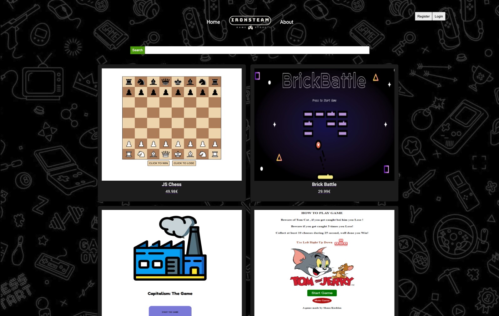

# IronSteam

[Visit IronSteam](https://ironsteam.netlify.app/)

Welcome to **IronSteam**, the premier platform for showcasing and distributing JavaScript games created by our talented cohort. IronSteam allows developers to register, login, and publish their games, providing a dedicated space for their creations to be enjoyed by players worldwide.

## Features

- **User Registration and Login:** Secure sign-up and authentication system for game developers.
- **Game Publishing:** Developers can upload their JavaScript games, providing details like title, description, and gameplay instructions.
- **Game Browsing and Playing:** Players can browse a variety of games and play them directly within their browsers.
- **Interactive User Interface:** A sleek, user-friendly interface that enhances the overall experience for both developers and players.

## Acknowledgments

- **Cohort Collaboration:** A heartfelt thank you to all my cohort members for their incredible teamwork and creativity throughout the game development process. Your innovative ideas and dedication have been fundamental to the success of IronSteam.
